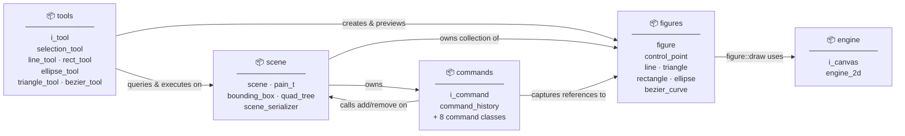

# pain_t — Architecture Overview

High-level package dependency map. See `diagrams/` for detailed class diagrams per package.

## Package → File Map

| Package | Detail diagram |
|---|---|
| `engine` | [diagrams/engine.md](diagrams/engine.md) |
| `figures` | [diagrams/figures.md](diagrams/figures.md) |
| `scene` | [diagrams/scene.md](diagrams/scene.md) |
| `tools` | [diagrams/tools.md](diagrams/tools.md) |
| `commands` | [diagrams/commands.md](diagrams/commands.md) |

## Dependency Rules

- `engine` has **no** dependencies on other packages.
- `figures` depends only on `engine` (via `i_canvas`).
- `commands` and `tools` depend on `figures` and `scene`, never on each other.
- `scene` depends on `figures` and `commands` but **not** on `tools` — tools call into scene, not the other way around.