# Package: commands

Undo/redo system (GoF Command pattern).
Depends on: `figures`, `scene`.

```mermaid
classDiagram
    %% External stubs
    class figure { <<abstract>> }
    class bezier
    class scene

    class i_command {
        <<interface>>
        + execute()*
        + undo()*
    }

    class command_history {
        - undo_stack: stack~i_command*~
        - redo_stack: stack~i_command*~
        + add(cmd: i_command*)
        + undo()
        + redo()
        + clear()
        + can_undo() bool
        + can_redo() bool
    }

    class create_figure_command {
        - _scene: scene*
        - _figure: figure*
        - _owns_figure: bool
        + execute()
        + undo()
    }

    class delete_figure_command {
        - _scene: scene*
        - _figure: figure*
        - _owns_figure: bool
        + execute()
        + undo()
    }

    class move_figure_command {
        - _scene: scene*
        - _figure: figure*
        - _delta: point
        + execute()
        + undo()
    }

    class deform_figure_command {
        - _scene: scene*
        - _figure: figure*
        - _old_points: vector~point~
        - _new_points: vector~point~
        + execute()
        + undo()
    }

    class change_color_command {
        - _figure: figure*
        - _type: color_type
        - _old_color: color
        - _new_color: color
        + execute()
        + undo()
    }

    class clear_scene_command {
        - _scene: scene*
        - _figures: vector~figure*~
        - _selected_figure: figure*
        - _owns_figures: bool
        + execute()
        + undo()
    }

    class increase_degree_command {
        - _bezier: bezier*
        - _scene: scene*
        - _old_control_points: vector~control_point~
        - _new_control_points: vector~control_point~
        + execute()
        + undo()
    }

    class reorder_figures_command {
        - _scene: scene*
        - _source_idx: int
        - _target_idx: int
        + execute()
        + undo()
    }

    class scale_figure_command {
        - _figure: figure*
        - _scene: scene*
        - _factor: double
        + execute()
        + undo()
    }

    class subdivide_bezier_command {
        - _scene: scene*
        - _original: bezier*
        - _left: bezier*
        - _right: bezier*
        - _is_executed: bool
        + execute()
        + undo()
    }

    class toggle_border_command {
        - _figure: figure*
        - _old_val: bool
        - _new_val: bool
        + execute()
        + undo()
    }

    class toggle_fill_command {
        - _figure: figure*
        - _old_val: bool
        - _new_val: bool
        + execute()
        + undo()
    }

    i_command <|-- create_figure_command
    i_command <|-- delete_figure_command
    i_command <|-- move_figure_command
    i_command <|-- deform_figure_command
    i_command <|-- change_color_command
    i_command <|-- clear_scene_command
    i_command <|-- increase_degree_command
    i_command <|-- reorder_figures_command
    i_command <|-- scale_figure_command
    i_command <|-- subdivide_bezier_command
    i_command <|-- toggle_border_command
    i_command <|-- toggle_fill_command

    command_history o-- i_command

    create_figure_command      --> scene
    delete_figure_command      --> scene
    move_figure_command        --> scene
    clear_scene_command        --> scene
    reorder_figures_command    --> scene
    deform_figure_command      --> scene
    subdivide_bezier_command   --> scene
    change_color_command       --> figure
```

## Notes

### `i_command`

No separate redo() method.
execute() IS redo — same operation replayed.
All implementations must be fully reversible.

### `command_history`

add() clears redo_stack — branching history is not supported.
undo(): pop undo_stack → call undo() → push to redo_stack.
redo(): pop redo_stack → call execute() → push to undo_stack.
can_undo/redo() used by draw_ui() to enable/disable buttons.

### `create_figure_command`

execute(): scene.add_figure(figure)
undo():    scene.remove_figure(figure)

### `delete_figure_command`

execute(): scene.remove_figure(figure)
undo():    scene.add_figure(figure)
Keeps shared_ptr alive so figure survives deletion.

### `move_figure_command`

Used when dragging the center handle (whole figure move).
execute(): figure.translate(+delta)
           scene.notify_figure_moved(figure)
undo():    figure.translate(-delta)
           scene.notify_figure_moved(figure)
One command pushed per complete drag (on mouse_up), not per pixel.
shared_ptr keeps figure alive through delete/undo sequences.

### `move_control_point_command` / `deform_figure_command`

Used when dragging an individual control point (deformation).
One command pushed per complete drag (on mouse_up), not per pixel.

### `change_color_command`

Captures both border and fill so a single
command handles any color change.
shared_ptr keeps figure alive through delete/undo sequences.

### `clear_scene_command`

execute(): snapshot = scene.get_all_figures()
          scene.clear_all_figures()
undo():    for each f in snapshot: scene.add_figure(f)
Re-snapshots on every execute() call, so redo is safe:
after undo() the scene is restored, and the next
execute() snapshots the same list and clears again.
