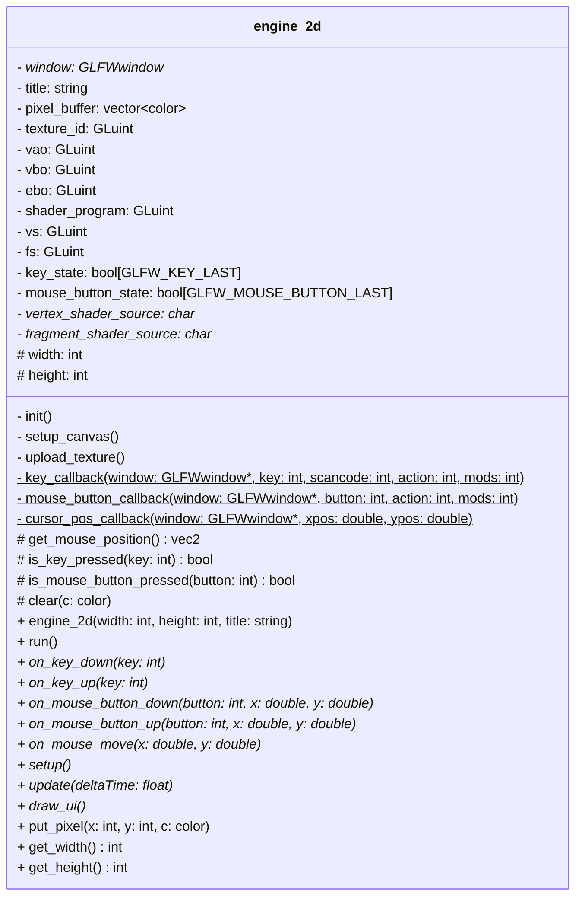

# Package: engine

Rendering infrastructure. Defines the `i_canvas` abstraction (now directly in `engine_2d` public API) and `engine_2d` class.
No dependencies on any other package in this project.

## Notes

### `engine_2d`

Subclass this to build an application.
The pixel buffer is a flat vector uploaded
to a full-screen OpenGL texture each frame.
Do NOT call put_pixel from draw_ui() — ImGui runs
after the texture is uploaded; pixel writes there are lost.
