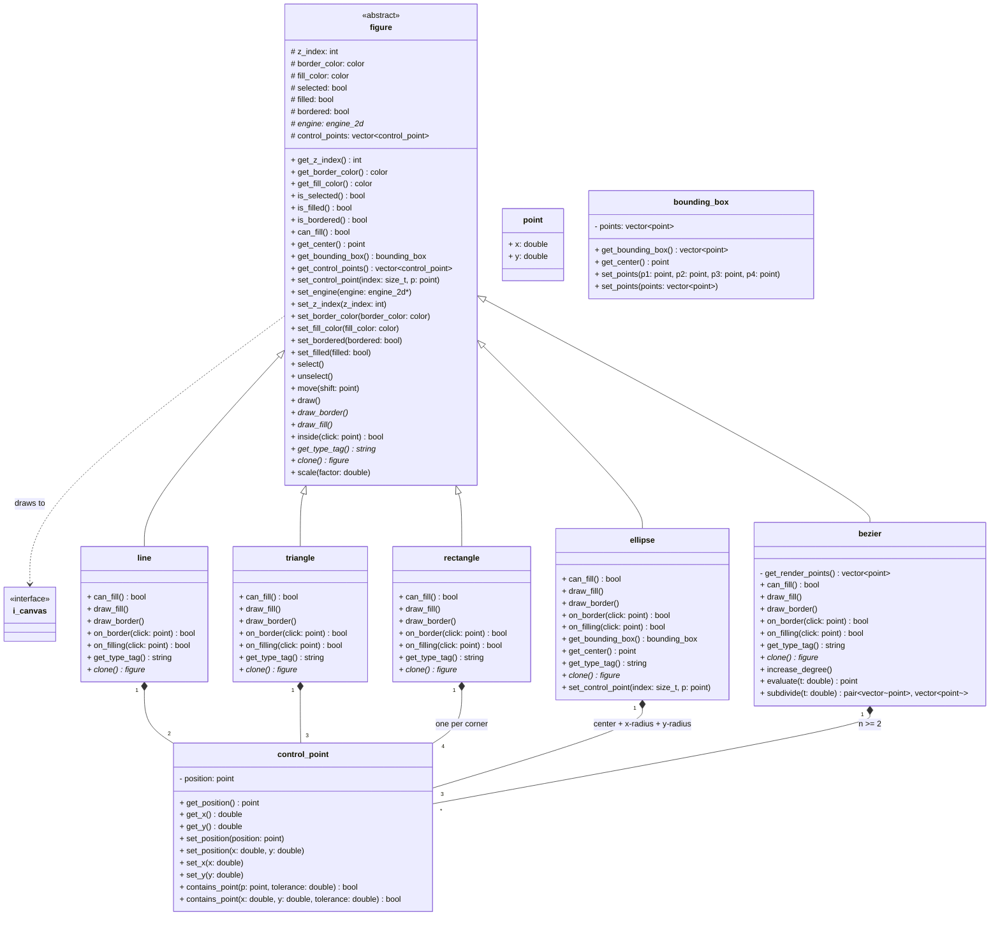

# Package: figures

Domain model. All 2D primitives and their control points.
Depends on: `engine` (via `i_canvas`).

## Notes

### `figure`

contains_point contract:
 - No fill: true if point is on border within a pixel tolerance
 - Has fill: true if point is inside filled area OR on border
can_fill() default returns true. line overrides to return false.
  Used by draw_ui() to show/hide the fill color picker.
  Used by inside() implementations to choose hit-test strategy.
get_center() is derived (centroid of control points), never stored.
get_type_tag() returns a fixed string per subclass
  (e.g. 'line', 'rectangle') used by scene_serializer
  to write the type into the .p_t file.

### `point`

A simple geometric coordinate structure to avoid
polluting `figures` with external math libraries.

### `bounding_box`

Used internally by quad_tree for subdivision
and range query logic. Every figure computes
its own bounds.

### `control_point`

contains_point used for drag hit-detection.
Each control_point is individually selectable
to deform the parent figure.

### `line`

can_fill() returns false — line is border only, never filled.
on_border: true if distance from point
to segment is within a pixel tolerance.

### `rectangle`

Control points are the 4 corners.
Dragging one corner deforms the rectangle.
Ctrl held during creation forces a square.

### `ellipse`

3 control points: center, x-radius handle, y-radius handle.
Ctrl held during creation forces rx == ry (circle).

### `bezier`

degree = n_control_points - 1.
Can be subdivided into two independent bezier curves.
