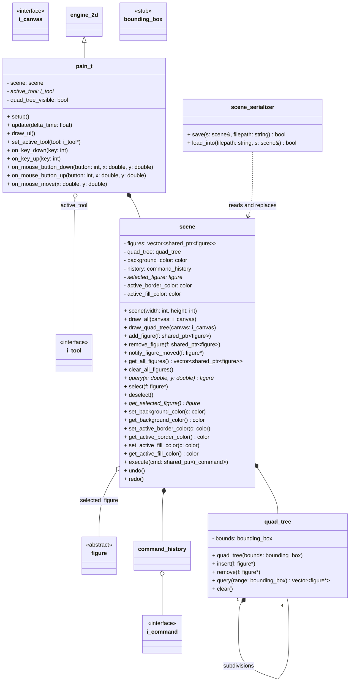

# Package: scene

World state, spatial index, and application entry point.
Depends on: `figures`, `commands`, `engine`, `tools` (via `i_tool` pointer only).

## Notes

### `quad_tree`

Constructed with the full canvas bounding_box as its root region.
Subdivides into 4 children when a node exceeds capacity.
All queries and insertions are bounded by this root region.

### `scene`

scene(width, height): constructs quad_tree with
  bounding_box{0, 0, width, height} as its root region.
draw_all renders figures sorted by z_index ascending.
draw_quad_tree recursively draws each quad_tree node bounding box.
  Designed to support an optional selection-search animation in the future.
execute() forwards to command_history and keeps quad_tree in sync.
clear_all_figures(): removes all figures, clears quad_tree, deselects.
  Used by clear_canvas_command::execute() and scene_serializer::load_into().
selected_figure is nullable (nullptr = nothing selected).
active_border_color / active_fill_color: the 'brush state'.
  Drawing tools read these in on_mouse_down() when constructing
  the preview figure, so new figures inherit the user's current color.
  Set by draw_ui() via scene.set_active_border/fill_color().

### `pain_t`

Rendering order inside update() each frame:
  1. scene.draw_all(canvas)          — background + committed figures
  2. if quad_tree_visible:           — global toggle, Q key in on_key_down
        scene.draw_quad_tree(canvas) — always up to date (real-time per spec)
  3. active_tool->draw_preview(canvas) — ghost or selection decorations on top
set_active_tool() calls reset() on the outgoing tool before switching.
All input events are blindly delegated to active_tool.
pain_t never directly manages figures or commands.

### `scene_serializer`

.p_t file format (plain text, UTF-8):
  Line 1:  'pain_t v1'            — magic header + version
  Line 2:  'background R G B'     — canvas background color
  Blank line between figures.
  Per figure block:
    'figure <type_tag>'           — from figure::get_type_tag()
    'z_index <N>'
    'border_color R G B'
    'fill_color R G B'
    'control_points <N>'
    'cp X Y'  (one line per point)

save() returns false on I/O error.
load_into() clears scene entirely (figures + quad_tree +
  command_history) before loading new state.
Returns false if the file is missing or the header is wrong version.

