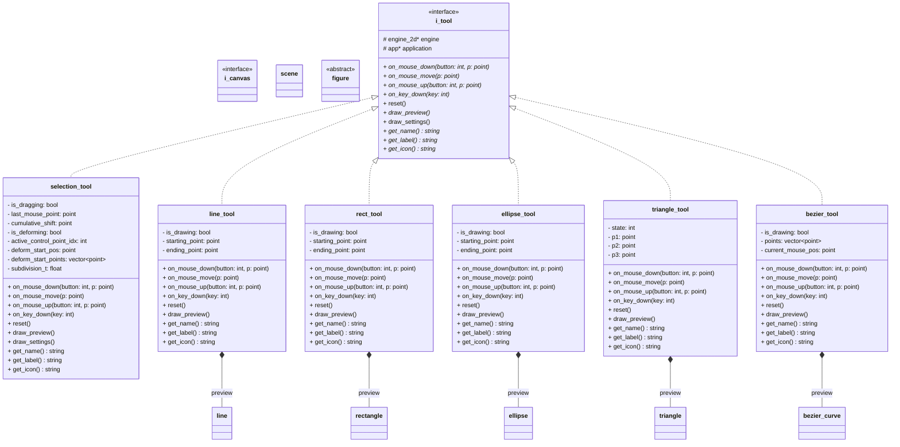

# Package: tools

Interaction FSM (GoF State pattern). Each tool is a state object.
Depends on: `figures`, `scene`, `engine` (via `i_canvas`).

## Notes

### `i_tool`

pain_t delegates all input events here.
Each tool reads and mutates scene only through
scene's public API (query, select, execute).
reset() is called by pain_t::set_active_tool() before
the old tool is replaced — clears preview and resets
internal phase back to its default state.

### `selection_tool`

Internal selection_phase FSM:
 IDLE
  └─ click figure ──────────────► FIGURE_SELECTED
 FIGURE_SELECTED
  ├─ drag center handle ────────► DRAGGING_FIGURE
  └─ drag control point ────────► DRAGGING_CONTROL_POINT
 DRAGGING_FIGURE
  └─ mouse up → push move_figure_command → FIGURE_SELECTED
 DRAGGING_CONTROL_POINT
  └─ mouse up → push move_control_point_command → FIGURE_SELECTED
dragged_cp tracks the specific control_point being moved.
draw_preview() renders selection decorations only:
 - border highlight on selected figure
 - small square handle at each control_point position
 - extra circle handle at get_center() for whole-figure move
Quad tree overlay is NOT rendered here — it is global
state managed by pain_t, drawn between draw_all() and draw_preview().

### `line_tool`

on_mouse_down: instantiate preview.
on_mouse_move: update endpoint of preview.
on_mouse_up: push create_figure_command, clear preview.
draw_preview() renders preview with a fixed PREVIEW_COLOR
(distinct solid color — no alpha blending needed).
The ghost shows border only, no fill.

### `rect_tool`

constrain toggled by on_key_down/up(CTRL).
When true, forces width == height (square).

### `ellipse_tool`

constrain toggled by on_key_down/up(CTRL).
When true, forces rx == ry (circle).
