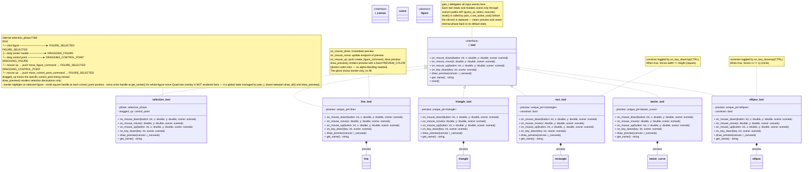

# Package: tools

Interaction FSM (GoF State pattern). Each tool is a state object.
Depends on: `figures`, `scene`, `engine` (via `i_canvas`).

```mermaid
classDiagram
    %% External stubs
    class i_canvas { <<interface>> }
    class scene
    class figure { <<abstract>> }
    class line
    class rectangle
    class ellipse
    class triangle
    class bezier_curve

    class i_tool {
        <<interface>>
        + on_mouse_down(button: int, x: double, y: double, scene: scene&)*
        + on_mouse_move(x: double, y: double, scene: scene&)*
        + on_mouse_up(button: int, x: double, y: double, scene: scene&)*
        + on_key_down(key: int, scene: scene&)*
        + draw_preview(canvas: i_canvas&)*
        + get_name() string*
        + reset()*
    }
    note for i_tool "pain_t delegates all input events here.
Each tool reads and mutates scene only through
scene's public API (query_at, select, execute).
reset() is called by pain_t::set_active_tool() before
the old tool is replaced — clears preview and resets
internal phase back to its default state."

    class selection_tool {
        - phase: selection_phase
        - dragged_cp: control_point*
        + on_mouse_down(button: int, x: double, y: double, scene: scene&)
        + on_mouse_move(x: double, y: double, scene: scene&)
        + on_mouse_up(button: int, x: double, y: double, scene: scene&)
        + on_key_down(key: int, scene: scene&)
        + draw_preview(canvas: i_canvas&)
        + get_name() string
    }
    note for selection_tool "Internal selection_phase FSM:
 IDLE
  └─ click figure ──────────────► FIGURE_SELECTED
 FIGURE_SELECTED
  ├─ drag center handle ────────► DRAGGING_FIGURE
  └─ drag control point ────────► DRAGGING_CONTROL_POINT
 DRAGGING_FIGURE
  └─ mouse up → push move_figure_command → FIGURE_SELECTED
 DRAGGING_CONTROL_POINT
  └─ mouse up → push move_control_point_command → FIGURE_SELECTED
dragged_cp tracks the specific control_point being moved.
draw_preview() renders selection decorations only:
 - border highlight on selected figure
 - small square handle at each control_point position
 - extra circle handle at get_center() for whole-figure move
Quad tree overlay is NOT rendered here — it is global
state managed by pain_t, drawn between draw_all() and draw_preview()."

    class line_tool {
        - preview: unique_ptr~line~
        + on_mouse_down(button: int, x: double, y: double, scene: scene&)
        + on_mouse_move(x: double, y: double, scene: scene&)
        + on_mouse_up(button: int, x: double, y: double, scene: scene&)
        + on_key_down(key: int, scene: scene&)
        + draw_preview(canvas: i_canvas&)
        + get_name() string
    }
    note for line_tool "on_mouse_down: instantiate preview.
on_mouse_move: update endpoint of preview.
on_mouse_up: push create_figure_command, clear preview.
draw_preview() renders preview with a fixed PREVIEW_COLOR
(distinct solid color — no alpha blending needed).
The ghost shows border only, no fill."

    class rect_tool {
        - preview: unique_ptr~rectangle~
        - constrain: bool
        + on_mouse_down(button: int, x: double, y: double, scene: scene&)
        + on_mouse_move(x: double, y: double, scene: scene&)
        + on_mouse_up(button: int, x: double, y: double, scene: scene&)
        + on_key_down(key: int, scene: scene&)
        + draw_preview(canvas: i_canvas&)
        + get_name() string
    }
    note for rect_tool "constrain toggled by on_key_down/up(CTRL).
When true, forces width == height (square)."

    class ellipse_tool {
        - preview: unique_ptr~ellipse~
        - constrain: bool
        + on_mouse_down(button: int, x: double, y: double, scene: scene&)
        + on_mouse_move(x: double, y: double, scene: scene&)
        + on_mouse_up(button: int, x: double, y: double, scene: scene&)
        + on_key_down(key: int, scene: scene&)
        + draw_preview(canvas: i_canvas&)
        + get_name() string
    }
    note for ellipse_tool "constrain toggled by on_key_down/up(CTRL).
When true, forces rx == ry (circle)."

    class triangle_tool {
        - preview: unique_ptr~triangle~
        + on_mouse_down(button: int, x: double, y: double, scene: scene&)
        + on_mouse_move(x: double, y: double, scene: scene&)
        + on_mouse_up(button: int, x: double, y: double, scene: scene&)
        + on_key_down(key: int, scene: scene&)
        + draw_preview(canvas: i_canvas&)
        + get_name() string
    }

    class bezier_tool {
        - preview: unique_ptr~bezier_curve~
        + on_mouse_down(button: int, x: double, y: double, scene: scene&)
        + on_mouse_move(x: double, y: double, scene: scene&)
        + on_mouse_up(button: int, x: double, y: double, scene: scene&)
        + on_key_down(key: int, scene: scene&)
        + draw_preview(canvas: i_canvas&)
        + get_name() string
    }

    i_tool <|.. selection_tool
    i_tool <|.. line_tool
    i_tool <|.. rect_tool
    i_tool <|.. ellipse_tool
    i_tool <|.. triangle_tool
    i_tool <|.. bezier_tool

    line_tool     *-- line        : preview
    rect_tool     *-- rectangle   : preview
    ellipse_tool  *-- ellipse     : preview
    triangle_tool *-- triangle    : preview
    bezier_tool   *-- bezier_curve : preview
```
